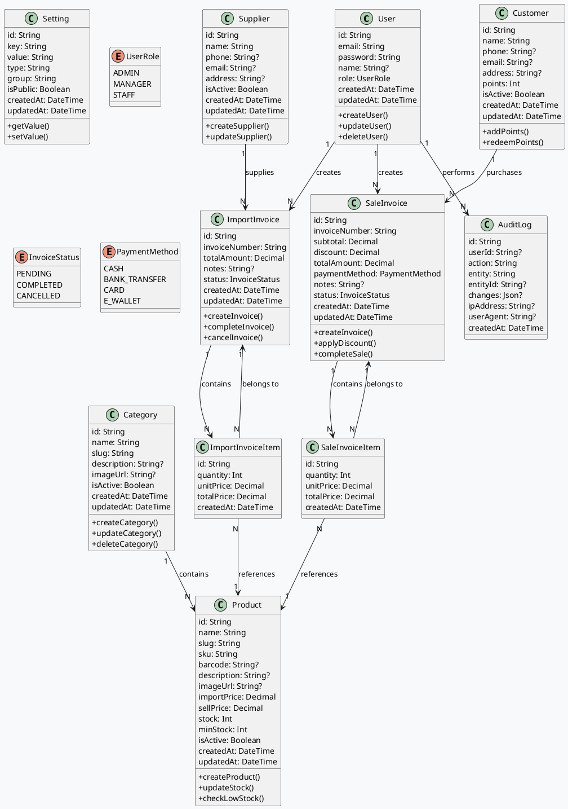
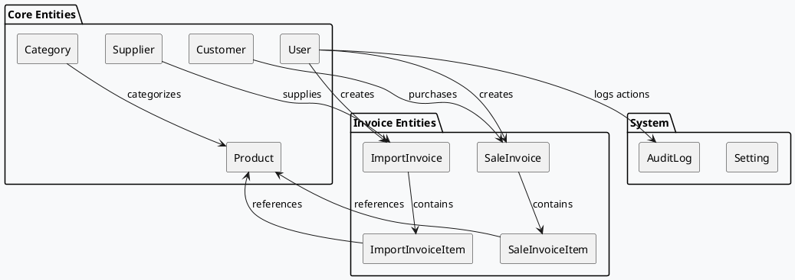

# Store Manager - Database Documentation

## Mục lục

1. [Tổng quan](#tổng-quan)
2. [Sơ đồ Class Diagram](#sơ-đồ-class-diagram)
3. [Mô tả các bảng](#mô-tả-các-bảng)
4. [Quan hệ giữa các bảng](#quan-hệ-giữa-các-bảng)
5. [Prisma Schema](#prisma-schema)

---

## Tổng quan

Hệ thống quản lý cửa hàng tạp hóa sử dụng PostgreSQL làm cơ sở dữ liệu với Prisma ORM để quản lý truy vấn. Database được thiết kế để hỗ trợ:

- **Quản lý sản phẩm**: Thông tin sản phẩm, giá cả, tồn kho
- **Quản lý danh mục**: Phân loại sản phẩm theo danh mục
- **Hóa đơn nhập hàng**: Lưu trữ thông tin nhập hàng từ nhà cung cấp
- **Hóa đơn bán hàng**: Lưu trữ thông tin bán hàng cho khách
- **Quản lý người dùng**: Phân quyền và xác thực người dùng
- **Audit Log**: Theo dõi các thay đổi trong hệ thống

---

## Sơ đồ Class Diagram

### Class Diagram Overview



### Database Schema Diagram



---

## Mô tả các bảng

### 1. User (Người dùng)

| Trường | Kiểu dữ liệu | Mô tả |
|--------|---------------|--------|
| id | String (cuid) | Khóa chính |
| email | String | Email đăng nhập (unique) |
| password | String | Mật khẩu (đã hash) |
| name | String? | Tên người dùng |
| role | UserRole | Vai trò: ADMIN, MANAGER, STAFF |
| createdAt | DateTime | Thời gian tạo |
| updatedAt | DateTime | Thời gian cập nhật |

**Vai trò:**
- `ADMIN`: Toàn quyền hệ thống
- `MANAGER`: Quản lý cửa hàng
- `STAFF`: Nhân viên bán hàng

---

### 2. Category (Danh mục)

| Trường | Kiểu dữ liệu | Mô tả |
|--------|---------------|--------|
| id | String (cuid) | Khóa chính |
| name | String | Tên danh mục |
| slug | String | Slug URL (unique) |
| description | String? | Mô tả |
| imageUrl | String? | URL hình ảnh |
| isActive | Boolean | Trạng thái hoạt động |
| createdAt | DateTime | Thời gian tạo |
| updatedAt | DateTime | Thời gian cập nhật |

---

### 3. Product (Sản phẩm)

| Trường | Kiểu dữ liệu | Mô tả |
|--------|---------------|--------|
| id | String (cuid) | Khóa chính |
| name | String | Tên sản phẩm |
| slug | String | Slug URL (unique) |
| sku | String | Mã SKU (unique) |
| barcode | String? | Mã vạch (unique) |
| description | String? | Mô tả |
| imageUrl | String? | URL hình ảnh |
| importPrice | Decimal(12,2) | Giá nhập |
| sellPrice | Decimal(12,2) | Giá bán |
| stock | Int | Số lượng tồn kho |
| minStock | Int | Số lượng tối thiểu |
| isActive | Boolean | Trạng thái hoạt động |
| categoryId | String? | FK đến Category |
| createdAt | DateTime | Thời gian tạo |
| updatedAt | DateTime | Thời gian cập nhật |

**Quan hệ:**
- Nhiều Product thuộc về 1 Category (Many-to-One)
- 1 Product có nhiều ImportInvoiceItem (One-to-Many)
- 1 Product có nhiều SaleInvoiceItem (One-to-Many)

---

### 4. Supplier (Nhà cung cấp)

| Trường | Kiểu dữ liệu | Mô tả |
|--------|---------------|--------|
| id | String (cuid) | Khóa chính |
| name | String | Tên nhà cung cấp |
| phone | String? | Số điện thoại |
| email | String? | Email |
| address | String? | Địa chỉ |
| isActive | Boolean | Trạng thái hoạt động |
| createdAt | DateTime | Thời gian tạo |
| updatedAt | DateTime | Thời gian cập nhật |

---

### 5. Customer (Khách hàng)

| Trường | Kiểu dữ liệu | Mô tả |
|--------|---------------|--------|
| id | String (cuid) | Khóa chính |
| name | String | Tên khách hàng |
| phone | String? | Số điện thoại |
| email | String? | Email |
| address | String? | Địa chỉ |
| points | Int | Điểm tích lũy |
| isActive | Boolean | Trạng thái hoạt động |
| createdAt | DateTime | Thời gian tạo |
| updatedAt | DateTime | Thời gian cập nhật |

---

### 6. ImportInvoice (Hóa đơn nhập hàng)

| Trường | Kiểu dữ liệu | Mô tả |
|--------|---------------|--------|
| id | String (cuid) | Khóa chính |
| invoiceNumber | String | Số hóa đơn (unique) |
| supplierId | String? | FK đến Supplier |
| totalAmount | Decimal(15,2) | Tổng tiền |
| notes | String? | Ghi chú |
| status | InvoiceStatus | Trạng thái |
| createdById | String | FK đến User |
| createdAt | DateTime | Thời gian tạo |
| updatedAt | DateTime | Thời gian cập nhật |

**Trạng thái:**
- `PENDING`: Đang chờ xử lý
- `COMPLETED`: Đã hoàn thành
- `CANCELLED`: Đã hủy

---

### 7. ImportInvoiceItem (Chi tiết hóa đơn nhập hàng)

| Trường | Kiểu dữ liệu | Mô tả |
|--------|---------------|--------|
| id | String (cuid) | Khóa chính |
| importInvoiceId | String | FK đến ImportInvoice |
| productId | String | FK đến Product |
| quantity | Int | Số lượng nhập |
| unitPrice | Decimal(12,2) | Đơn giá |
| totalPrice | Decimal(15,2) | Thành tiền |
| createdAt | DateTime | Thời gian tạo |

**Ràng buộc:** Xóa cascade khi xóa ImportInvoice

---

### 8. SaleInvoice (Hóa đơn bán hàng)

| Trường | Kiểu dữ liệu | Mô tả |
|--------|---------------|--------|
| id | String (cuid) | Khóa chính |
| invoiceNumber | String | Số hóa đơn (unique) |
| customerId | String? | FK đến Customer |
| subtotal | Decimal(15,2) | Tổng phụ |
| discount | Decimal(15,2) | Giảm giá |
| totalAmount | Decimal(15,2) | Tổng cộng |
| paymentMethod | PaymentMethod | Phương thức thanh toán |
| notes | String? | Ghi chú |
| status | InvoiceStatus | Trạng thái |
| createdById | String | FK đến User |
| createdAt | DateTime | Thời gian tạo |
| updatedAt | DateTime | Thời gian cập nhật |

**Phương thức thanh toán:**
- `CASH`: Tiền mặt
- `BANK_TRANSFER`: Chuyển khoản
- `CARD`: Thẻ
- `E_WALLET`: Ví điện tử

---

### 9. SaleInvoiceItem (Chi tiết hóa đơn bán hàng)

| Trường | Kiểu dữ liệu | Mô tả |
|--------|---------------|--------|
| id | String (cuid) | Khóa chính |
| saleInvoiceId | String | FK đến SaleInvoice |
| productId | String | FK đến Product |
| quantity | Int | Số lượng bán |
| unitPrice | Decimal(12,2) | Đơn giá |
| totalPrice | Decimal(15,2) | Thành tiền |
| createdAt | DateTime | Thời gian tạo |

**Ràng buộc:** Xóa cascade khi xóa SaleInvoice

---

### 10. Setting (Cài đặt)

| Trường | Kiểu dữ liệu | Mô tả |
|--------|---------------|--------|
| id | String (cuid) | Khóa chính |
| key | String | Khóa cài đặt (unique) |
| value | String | Giá trị |
| type | String | Kiểu dữ liệu |
| group | String | Nhóm cài đặt |
| isPublic | Boolean | Công khai |
| createdAt | DateTime | Thời gian tạo |
| updatedAt | DateTime | Thời gian cập nhật |

---

### 11. AuditLog (Nhật ký hệ thống)

| Trường | Kiểu dữ liệu | Mô tả |
|--------|---------------|--------|
| id | String (cuid) | Khóa chính |
| userId | String? | FK đến User |
| action | String | Hành động |
| entity | String | Entity bị tác động |
| entityId | String? | ID của entity |
| changes | Json? | Các thay đổi |
| ipAddress | String? | IP người dùng |
| userAgent | String? | User Agent |
| createdAt | DateTime | Thời gian tạo |

---

## Quan hệ giữa các bảng

### Sơ đồ ERD dạng text

```
┌─────────────┐     ┌─────────────┐     ┌─────────────┐
│    User     │────<│ImportInvoice│     │  Supplier   │
└─────────────┘     └─────────────┘     └─────────────┘
       │                   │                   │
       │                   │                   │
       │              ┌─────────────┐          │
       │              │ImportInvoice│          │
       │              │    Item     │          │
       │              └─────────────┘          │
       │                   │                   │
       │                   ▼                   │
       │              ┌─────────────┐         │
       │              │   Product    │<────────┘
       │              └─────────────┘
       │                   │
       │              ┌─────────────┐
       │              │SaleInvoice  │
       │              │    Item     │
       │              └─────────────┘
       │                   │
       │                   ▼
       │              ┌─────────────┐     ┌─────────────┐
       └─────────────>│ SaleInvoice │────<│  Customer   │
                      └─────────────┘     └─────────────┘

┌─────────────┐     ┌─────────────┐
│  Category    │────<│   Product    │
└─────────────┘     └─────────────┘

┌─────────────┐
│   Setting   │
└─────────────┘

┌─────────────┐
│  AuditLog   │
└─────────────┘
```

### Chi tiết quan hệ

| Quan hệ | Loại | Mô tả |
|---------|------|--------|
| User -> ImportInvoice | 1:N | Một User có thể tạo nhiều ImportInvoice |
| User -> SaleInvoice | 1:N | Một User có thể tạo nhiều SaleInvoice |
| User -> AuditLog | 1:N | Một User có thể tạo nhiều AuditLog |
| Category -> Product | 1:N | Một Category có nhiều Product |
| Product -> ImportInvoiceItem | 1:N | Một Product có nhiều ImportInvoiceItem |
| Product -> SaleInvoiceItem | 1:N | Một Product có nhiều SaleInvoiceItem |
| Supplier -> ImportInvoice | 1:N | Một Supplier có nhiều ImportInvoice |
| Customer -> SaleInvoice | 1:N | Một Customer có nhiều SaleInvoice |
| ImportInvoice -> ImportInvoiceItem | 1:N | Một ImportInvoice có nhiều ImportInvoiceItem |
| SaleInvoice -> SaleInvoiceItem | 1:N | Một SaleInvoice có nhiều SaleInvoiceItem |

---

## Prisma Schema

### File: `prisma/schema.prisma`

```prisma
// Xem chi tiết tại: prisma/schema.prisma

generator client {
  provider = "prisma-client-js"
}

datasource db {
  provider = "postgresql"
  url      = env("DATABASE_URL")
}

// Models: User, Category, Product, Supplier, Customer, 
//         ImportInvoice, ImportInvoiceItem, 
//         SaleInvoice, SaleInvoiceItem, Setting, AuditLog

// Enums: UserRole, InvoiceStatus, PaymentMethod
```

---

## Indexes

Các index được tạo tự động:

| Bảng | Index | Mục đích |
|------|-------|----------|
| User | email (unique) | Tìm kiếm nhanh theo email |
| Category | slug (unique) | Tìm kiếm nhanh theo slug |
| Product | slug (unique) | Tìm kiếm nhanh theo slug |
| Product | sku (unique) | Tìm kiếm nhanh theo SKU |
| Product | barcode (unique) | Tìm kiếm nhanh theo barcode |
| ImportInvoice | invoiceNumber (unique) | Tìm kiếm nhanh theo số hóa đơn |
| SaleInvoice | invoiceNumber (unique) | Tìm kiếm nhanh theo số hóa đơn |
| Setting | key (unique) | Tìm kiếm nhanh theo khóa cài đặt |

---

## Migrations

### Chạy migrations

```bash
# Tạo migration mới
npm run db:migrate

# Push schema xuống database (dev only)
npm run db:push

# Tạo Prisma Client
npm run db:generate

# Mở Prisma Studio
npm run db:studio
```

### Seed data

```bash
# Chạy seed data
npm run db:seed
```

---

## Cập nhật lần cuối

**Ngày tạo:** $(date +"%d/%m/%Y")
**Phiên bản:** 1.0.0
